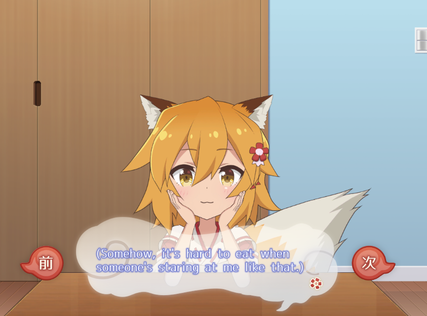
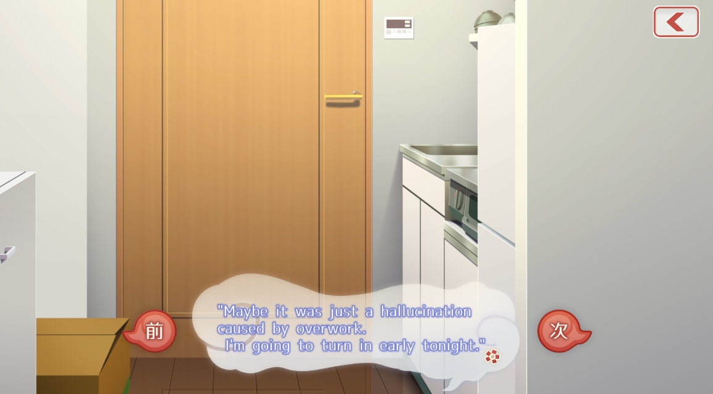

# Senko-san to Isshou Asset Localization

This repository is a collection of tutorials and Python tools for modifying and translating the assets stored inside the Unity Android game **Senko-san to Isshou**.

The game stores its story text, UI strings, and other resources inside the file:

```
original_app.apk\assets\bin\Data\datapack.unity3d
```

By unpacking, editing, and repacking that `datapack.unity3d` file, you can play the game in another language without needing to read Japanese (or modify it in some other way). This project also covers the harder-to-translate parts such as GUI images (buttons, menus, illustrations) that contain embedded Japanese text.

> **Tip:** The easiest way to patch your APK is to use the **[online patcher](https://senko-san-to-isshou-localizer-site.vercel.app/)**. If a premade datapack is already available for your language, upload it along with your original APK. Otherwise, translate the assets yourself first, then upload your original APK and modified `datapack.unity3d`. The site handles resigning and repackaging for you.

## A community effort

This project is a fan-driven, community effort. It only gets better when people like you help out, whether that means translating into a new language, reviewing machine-translated text, editing GUI images, improving the scripts, or fixing documentation.

Ways to contribute:

- **Add or finish a language** — create a folder under `assets/` with the right two-letter code and run the translation scripts.
- **Review and improve translations** — machine translation is a starting point; manual review makes a big difference for story-heavy games.
- **Translate GUI images** — buttons, menus, and illustrations still need manual editing. If you can automate this or want to contribute edited assets, open a pull request.
- **Improve the tools** — bug fixes, new features, and better documentation are always welcome.

If you want to help, open an issue or pull request on GitHub. Every contribution, no matter how small, helps more people enjoy the game.

## What you can do here

- Translate story dialogue and UI text into multiple languages.
- Replace the in-game font with one that supports the target script.
- Generate a patched `datapack.unity3d` ready to be inserted into the APK.
- Translate or edit GUI image assets (textures, atlases) that contain Japanese text.

## How it works

Everything is handled by a single Python script. The script uses [UnityPy](https://github.com/K0lb3/UnityPy) to read and write Unity asset bundles directly.

> Each language folder uses the two-letter code the translators expect (`en`, `es`, `fr`, `de`, `ko`, `nl`, etc.). Learn more in `tools/translation_tools/README.MD`.

## Quick workflow

1. **Get the APK**  
   Obtain `original_app.apk` from your own copy of the game.
   
   Change the extension to `.zip` (e.g., rename it to `original_app.zip`) and unzip it. Copy the datapack to `assets/original/`:
   ```
   assets/bin/Data/datapack.unity3d  →  assets/original/datapack.unity3d
   ```

2. **Translate and patch**  
   ```bash
   cd tools/translation_tools
   python main.py
   ```
   The script will:
   - List available language folders and ask you to pick one (or all).
   - Translate Japanese text using DeepL or Google Translate.
   - Prompt you to select a replacement font from `fonts/`.
   - Generate an SDF atlas and patch the font asset.
   - Replace TextAssets in `datapack.unity3d` with translated versions.
   - Replace GUI images from `assets/{lang}/img/` if the folder exists.
   - Save the patched datapack to `assets/{lang}/{lang}.unity3d`.

   If your language is not available, create a folder with a `TextAsset/` subfolder under `assets/` using the language's two-letter code.

   Optionally set up a DeepL API key for higher-quality translations (see [Python setup](#python-setup) below).

3. **Translate GUI images** *(optional)*  
   Place translated images in `assets/{lang}/img/` using the same filenames as in `assets/original/img/`. The script will automatically replace matching textures in the datapack during patching. If no `img/` folder is present, this step is skipped.
   
   GUI textures with embedded Japanese text still need manual editing. If you can contribute translated images, open a pull request.

4. **Patch the APK**  
   Upload your original APK and patched `{lang}.unity3d` to the online patcher:  
   [senko-san-to-isshou-localizer-site.vercel.app](https://senko-san-to-isshou-localizer-site.vercel.app/)

   The site handles resigning and repackaging for you.

   ([source code](https://github.com/iznkd/Senko-san_to_Isshou_localizer_site))

## Python setup

This project uses **Python 3.13+**. Install dependencies with:

```bash
pip install -e .
```

The core packages used by the scripts are listed in `pyproject.toml` and installed with `pip install -e .`;
### Optional: DeepL

If you have a DeepL API key, use a .env.example to create a .env file and add your key:

```
DEEPL_API_KEY=your_key_here
```

Without a DeepL key, the scripts fall back to Google Translate.

## Notes and limitations

- This repository is intended for **personal and fan-translation use only**. Respect the game publisher's intellectual property and terms of service.
- Do not redistribute copyrighted game assets or patched APKs.
- Machine translation (Google / DeepL) is a good starting point, but it may miss nuance. Manual review is recommended.

## Preview





## Disclaimer

This project is an unofficial fan effort. All game names, characters, and assets belong to their respective owners.
