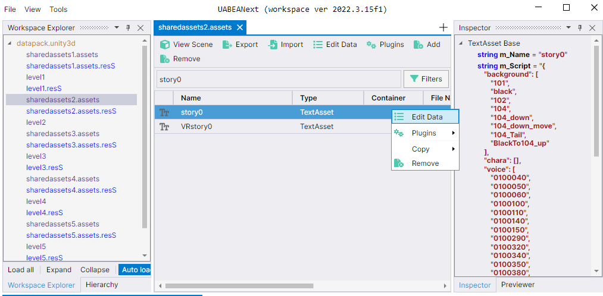

# Senko-san to Isshou Asset Localization

This repository is a collection of tutorials and Python tools for modifying and translating the assets stored inside the Unity Android game **Senko-san to Isshou**.

The game stores its story text, UI strings, and other resources inside the file:

```
original_app.apk\assets\bin\Data\datapack.unity3d
```

By unpacking, editing, and repacking that `datapack.unity3d` file, you can play the game in another language without needing to read Japanese (or modify it in some other way). This project also covers the harder-to-translate parts such as GUI images (buttons, menus, illustrations) that contain embedded Japanese text.

> **Tip:** The easiest way to patch your APK is to use the **[online patcher](https://senko-san-to-isshou-localizer-site.vercel.app/)**. If a premade datapack is already available for your language, upload it along with your original APK. Otherwise, translate the assets yourself first, then upload your original APK and modified `datapack.unity3d`. The site handles resigning and repackaging for you.

## A community effort

This project is a fan-driven, community effort. It only gets better when people like you help out, whether that means translating into a new language, reviewing machine-translated text, editing GUI images, improving the scripts, or fixing documentation.

Ways to contribute:

- **Add or finish a language** — create a folder under `assets/` with the right two-letter code and run the translation scripts.
- **Review and improve translations** — machine translation is a starting point; manual review makes a big difference for story-heavy games.
- **Translate GUI images** — buttons, menus, and illustrations still need manual editing. If you can automate this or want to contribute edited assets, open a pull request.
- **Improve the tools** — bug fixes, new features, and better documentation are always welcome.

If you want to help, open an issue or pull request on GitHub. Every contribution, no matter how small, helps more people enjoy the game.

## What you can do here

- Extract the original `datapack.unity3d` from the APK.
- Pull out `TextAsset` files with tools such as **AssetRipper**.
- Translate story dialogue and UI text into multiple languages.
- Translate or edit GUI image assets (textures, atlases) that contain Japanese text.
- Repack the edited assets back into `datapack.unity3d` with **uabea**.
- Replace the original `datapack.unity3d` in the APK and install the patched game.

## What tools could be used

| Tool | Purpose |
|------|---------|
| **AssetRipper** (not necessary) | Dump the contents of `datapack.unity3d` into readable files (TextAssets, textures, meshes, etc.). This is the easiest way to get the initial assets. |
| **uabea** | Modify the `datapack.unity3d` asset bundle directly — replace translated TextAssets and textures without rebuilding the entire bundle from scratch. |
| **Python scripts in `tools/translation_tools/`** | Automate text extraction, translation, and conversion back to the Unity `m_Name` / `m_Script` wrapper format used by uabea. |


> Each language folder uses the two-letter code the translators expect (`en`, `es`, `fr`, `zh`, `de`, `ko`, `nl`, etc.). Learn more in `tools/translation_tools/README.MD`.

## Quick workflow

1. **Get the APK**  
   Obtain `original_app.apk` from your own copy of the game.
   
   Change the extension to `.zip` (e.g., rename it to `original_app.zip`) and unzip it. The datapack is located at:
   ```
   assets/bin/Data/datapack.unity3d
   ```

2. **Dump the assets (not necessary since the original assets that need translating are already extracted)**  
   Open `datapack.unity3d` with **AssetRipper** (or any other tool, but this is the one that I personally used) and export the assets.

   Copy the `Assets\TextAsset\*.bytes` files into `assets/original/TextAsset/`. 

   Images can be extracted from `Assets\Texture2D`.

3. **Translate the text**  
   ```bash
   cd tools/translation_tools
   python translate_assets.py
   ```
   - Set your `DEEPL_API_KEY` in `.env` to your DeepL API key as demonstrated in `.env.example`. If you don't have an API key, follow the instructions [here](https://developers.deepl.com/docs/getting-started/quickstart).
   - Select the language folder you want to translate.
   - The script reads from `assets/original/TextAsset/`, translates Japanese strings, and writes the results to `assets/{lang}/TextAsset/`.
   - It also produces `assets/{lang}/converted_assets/TextAsset/` in the `m_Name` / `m_Script` format Unity expects.

   - If your language is not available, you can create a folder yourself with its designated language code (used by DeepL).

4. **Translate GUI images**  
   GUI textures and atlases with embedded Japanese text are harder to localize automatically. This is where your help is most needed! If you can either create a tool that can do that reliably or edit them manually and submit a pull request, that would be greatly appreciated!

5. **Repack with uabea**  
   - Open `datapack.unity3d` in **uabea**.
   - Navigate to `sharedassets2.assets`
   - Search for assets that you want to replace and edit them using the button. From there you can delete the current content and replace it with your translated content in the `converted_assets` folder. There might be a better way than replacing each asset manually, but I haven't found it yet. If it could be done programmatically instead of needing 3rd party tools, let me know.
   - Save the modified `datapack.unity3d`.

   

6. **Patch the APK**  
   Replace the original `datapack.unity3d` inside `original_app.apk` with the modified one, re-sign the APK, and install it on your device.
   For that you can use this website:
   [senko-san-to-isshou-localizer-site.vercel.app](https://senko-san-to-isshou-localizer-site.vercel.app/)

   ([source code](https://github.com/iznkd/Senko-san_to_Isshou_localizer_site))

## Python setup

This project uses **Python 3.13+**. Install dependencies with:

```bash
pip install -e .
```

The core packages used by the scripts are listed in `pyproject.toml` and installed with `pip install -e .`;
### Optional: DeepL

If you have a DeepL API key, use a .env.example to create a .env file and add your key:

```
DEEPL_API_KEY=your_key_here
```

Without a DeepL key, the scripts fall back to Google Translate.

## Notes and limitations

- This repository is intended for **personal and fan-translation use only**. Respect the game publisher's intellectual property and terms of service.
- Do not redistribute copyrighted game assets or patched APKs.
- Machine translation (Google / DeepL) is a good starting point, but it may miss nuance. Manual review is recommended.

## Disclaimer

This project is an unofficial fan effort. All game names, characters, and assets belong to their respective owners.
